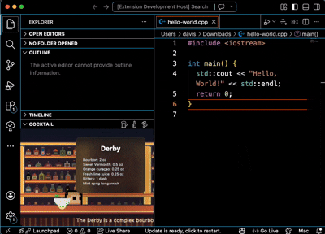

<div align="center">
  
  
  

# VS Code Cocktail

Turns your editor into a mini cocktail bar.



</div>

## Table of Contents

- [VS Code Cocktail](#vs-code-cocktail)
  - [Table of Contents](#table-of-contents)
  - [Installation](#installation)
  - [Features](#features)
  - [Development](#development)
  - [Build \& Test](#build--test)
  - [Localization](#localization)
  - [Contributing](#contributing)

## Installation

Install this extension from the VS Code [Marketplace](https://marketplace.visualstudio.com/items?itemName=DavisHo.vscode-cocktail).

## Features

- Display cocktail listings
- View cocktail ingredients, flavor notes, and preparation methods
- Randomly select a cocktail
- Show the current cocktail's flavor or preparation instructions
- Supports localization with built-in `en-US`, `ja-JP`, and `zh-TW`

## Development

1. Open VS Code and press `F5` to run the extension in the Extension Development Host.
2. Open the Cocktail view in the sidebar (registered under Explorer).
3. When the view loads, it automatically loads available cocktail information and images. You can browse ingredients, preparation steps, and flavor descriptions.
4. Use the command palette (`Ctrl/Cmd+Shift+P`) to run these commands:
   - `vscode-cocktail.randomDrink`: trigger a random cocktail selection in the panel.
   - `vscode-cocktail.showFlavorMessage`: display the current cocktail's flavor description as a notification.
   - `vscode-cocktail.showMethodMessage`: display the current cocktail's preparation method as a notification.

## Build & Test

- Install dependencies: `npm install`
- Compile and bundle:

```bash
npm run compile
```

- Run tests:

```bash
npm test
```

## Localization

- Cocktail data and localization strings are stored in the `l10n` and `media/drinks` folders.
- To add a new language, add a corresponding `.json` file to `l10n` and select the language in settings.

## Contributing

- Contributions are welcome. Feel free to submit a PR, report bugs, or suggest new cocktails.
